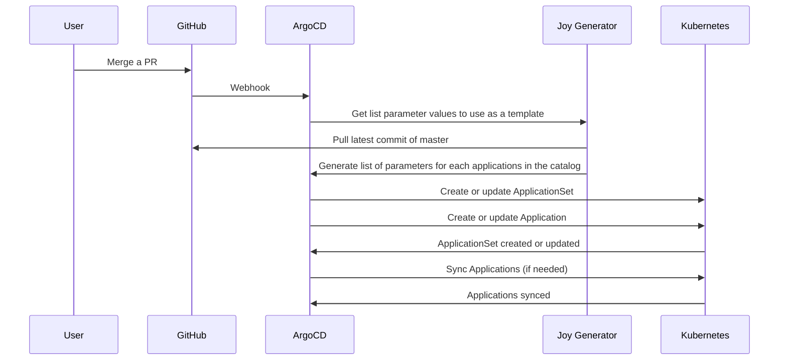

# joy-generator

ArgoCD plugin for expanding joy releases for the ArgoCD ApplicationSet Controller.

## How-to roll-out and test updates

1. Update this repo and merge to master (triggering a build & /release)
    1. Note the new release version# from https://github.com/nestoca/joy-generator/releases
    2. Ensure the same version is present [here](https://nestoca.github.io/joy-generator/index.yaml)
2. Apply the newly released version in `infra`'s component `ArgoCD.configureJoyGenerator()`'s `devVersion` [here](https://github.com/nestoca/infra/blob/c25905374ec678ec21ce468cb00628b572f70838/pulumi/platform/components/ArgoCD.ts#L478)
    1. do `pu main preview-markdown` on `infra/pulumi/platform` as part of your PR/roll-out & merge, as normal
4. Test the new version
    1. ℹ️ `devVersion` will be deployed to environments that contain `dev` in their name, `version` to all other envs
    2. Update the catalog (e.g. an [env-var in canary](https://github.com/nestoca/catalog/blob/bd549614d8ae932d92e43576031d288a8bba474d/environments/dev/releases/platform/canary.yaml#L80-L82)) & merge to master
    3. Verify that the env-var is present in ArgoCD's `Live Manifest` under [dev-canary > `rollout` > _latest_ `rs`(ReplicaSet) > `pod`](https://argocd.platform.nesto.ca/applications/dev-canary)
5. Apply the newly released version in `infra`'s component `ArgoCD.configureJoyGenerator()`'s `version` [here](https://github.com/nestoca/infra/blob/c25905374ec678ec21ce468cb00628b572f70838/pulumi/platform/components/ArgoCD.ts#L477)
    1. do `pu main preview-markdown` on `infra/pulumi/platform` as part of your PR/roll-out & merge, as normal
6. VICTORY! 💪

## Data Flow

ArgoCD's ApplicationSet controller will queries `joy-generator` on Webhooks or schedule. The latter returns a full list of parameters for each application in the catalog. The ApplicationSet controller will then create or update the Application resources in the cluster. See [Argo CD - Generators
Plugin](https://argo-cd.readthedocs.io/en/latest/operator-manual/applicationset/Generators-Plugin/) for more information.

